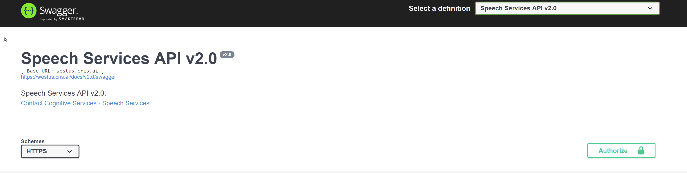

---?color=#303030&image=logo.png&position=right 10px top 10px&size=5%
@title[Auf den Mund geschaut…]

## Auf den Mund geschaut…
### Customized Speech to Text

@snap[south-west span-60]
Jan Schweda
@snapend

@snap[south-east span-60]
@jschweda
@snapend

+++?color=#303030&image=logo.png&position=right 10px top 10px&size=5%
@title[Agenda]

@snap[west span-40]
# Agenda
@snapend

@snap[north-east span-60 fragment]
@box[bg-blue text-white box-narrow-padding](Warum?#Warum sollte Inklusion ein Thema für mich sein?)
@snapend

@snap[east span-60 fragment]
@box[bg-blue text-white box-narrow-padding](Wie?#Verstanden! Aber wie fange ich an?)
@snapend

@snap[south-east span-60 fragment]
@box[bg-blue text-white box-narrow-padding](Und dann?#Ok, ganz nett. Aber wie geht es weiter?)
@snapend

---?color=#303030&image=logo.png&position=right 10px top 10px&size=5%

@title[Warum]
@snap[center]
# Warum?
@snapend

+++?color=#303030&image=logo.png&position=right 10px top 10px&size=5%
@title[Was zum schmunzeln]
@snap[north-west]
### Was zum schmunzeln
@snapend

<iframe width="900" height="500" src="https://www.youtube.com/embed/IKZToY-V16w" frameborder="0" allow="accelerometer; autoplay; encrypted-media; gyroscope; picture-in-picture" allowfullscreen></iframe>

+++?color=#303030&image=logo.png&position=right 10px top 10px&size=5%
@title[Wer braucht das?]
@snap[north-west]
### Wer braucht das?
@snapend

@ul
- 800.000 Stotterer in Deutschland
- 100.000 Menschen mit aphasischer Störung
- Audiogen bedingte Sprechstörungen
- Menschen mit starkem Dialekt
- Kinder
@ulend

+++?color=#303030&image=logo.png&position=right 10px top 10px&size=5%
@title[Conversational UI]
@snap[north-west]
### Conversational UI
@snapend

@ul
- Wer stellt seinen Wecker noch per Hand?
- Wer nutzt Siri, Alexa oder Cortana?
- Wer hat eine Freisprechanlage im Auto?
- Wie wird Mobility as a Service funktionieren?
@ulend

---?color=#303030&image=logo.png&position=right 10px top 10px&size=5%
@snap[center]
# Wie?
@snapend

+++?color=#303030&image=logo.png&position=right 10px top 10px&size=5%
@title[custom acoustic Model]
@snap[north-west]
### *custom acoustic Model* 
@snapend

@ul
- Nebengeräusche 
  - Landwirtschaft 
  - Werkstatt
- Spezielle Aussprache
@ulend

+++?color=#303030&image=logo.png&position=right 10px top 10px&size=5%
@title[Demo]
@snap[midpoint]
## Demo
#### So kann es aussehen
@snapend

+++?color=#303030&image=logo.png&position=right 10px top 10px&size=5%
@title[Eigenes akustisches Modell]
@snap[north-west]
### Warum CRIS 
@snapend

@ul
- Nativer Azure Dienst
- Start mit wenig Daten möglich
- Qualität steigt mit der Anzahl der Datensätze
@ulend

@snap[south-west span-50]
[Unterstütze Sprachen](https://docs.microsoft.com/en-us/azure/cognitive-services/speech-service/language-support#speech-to-text)
@snapend

@snap[south-east span-50]
[Weiterlesen](https://docs.microsoft.com/en-us/azure/cognitive-services/speech-service/how-to-customize-acoustic-models)
@snapend

+++?color=#303030&image=logo.png&position=right 10px top 10px&size=5%
@title[Workflow]
@snap[north-west span-40]
@box[bg-orange text-white box-wide-padding rounded](Aufnehmen @fa[arrows-h] Transkribieren)
@snapend

@snap[north-east span-40]
@box[bg-orange text-white box-wide-padding rounded](Hochladen)
@snapend

@snap[south-east span-40]
@box[bg-orange text-white box-wide-padding rounded](Trainieren)
@snapend

@snap[south-west span-40]
@box[bg-orange text-white box-wide-padding rounded](Benutzen)
@snapend

@snap[midpoint]
@fa[refresh fa-3x]
@snapend

+++?color=#303030&image=logo.png&position=right 10px top 10px&size=5%
@title[Aufnehmen]
@snap[north-west]
### Aufnehmen 
@snapend

@ul[square-bullets](false)
- Dateiformat           @fa[arrow-right] RIFF (WAV)
- Sampling Rate         @fa[arrow-right] 8,000 Hz / 16,000 Hz
- Kanäle                @fa[arrow-right] 1
- Sample Format         @fa[arrow-right] PCM, 16-bit int
- File Dauer            @fa[arrow-right] 0.1 Sec - 12 Sec
- Zip                   @fa[arrow-right] 2 GB Max.
- Hintergrundgeräusche  @fa[arrow-right] Zeit ohne Sprache aufnehmen
@ulend

+++?color=#303030&image=logo.png&position=right 10px top 10px&size=5%
@title[Recording Tools]
@snap[north-west]
### Recording Tools
@snapend

@ul
- Diktiergerät
- 3rd Party Tools
  - Online
  - [Audacity](https://sourceforge.net/projects/audacity/)
- Eigener Code
@ulend

+++?color=#303030&image=logo.png&position=right 10px top 10px&size=5%
@title[Demo]
@snap[midpoint]
## Demo
#### Recording
@snapend

+++?color=#303030&image=logo.png&position=right 10px top 10px&size=5%
@snap[north-west]
### Transkription
@snapend
@ul
- Eine Text Datei
- Eine Zeile je Datei
- ```Filename \t Transkription```
- UTF-8 + BOM
- Normalisiert
@ulend

@snap[south span-90]
[Weiterlesen...](https://docs.microsoft.com/en-us/azure/cognitive-services/speech-service/prepare-transcription#other-languages)
@snapende


+++?color=#303030&image=logo.png&position=right 10px top 10px&size=5%
@snap[north-west]
### Pflege
@snapend
@title[Pflege]

@ol
- [CRIS Portal](cris.ai)
- Import Acoustic Dataset
- Create Acoustic Model
- Test Model
- Publish Model
@olend
---?color=#303030&image=logo.png&position=right 10px top 10px&size=5%

@title[Demo]
@snap[midpoint]
## Demo
#### Upload Data & Train the model
@snapend

---?color=#303030&image=logo.png&position=right 10px top 10px&size=5%
@snap[center]
# Und dann?
@snapend

+++?color=#303030&image=logo.png&position=right 10px top 10px&size=5%
@title[API]
@snap[north-west]
### API 
@snapend

[Swagger](https://westus.cris.ai/swagger/ui/index#/Custom%20Speech%20models%3A)
+++?color=#303030&image=logo.png&position=right 10px top 10px&size=5%
@title[Integration]
@snap[north-west]
### Integration 
@snapend
[Google Device API](https://developers.google.com/assistant/sdk/)<br>
[Alexa API](https://developer.amazon.com/de/docs/alexa-voice-service/api-overview.html)<br>
Eigene Dienste
+++?color=#303030&image=logo.png&position=right 10px top 10px&size=5%
@title[Linguistische Modelle]
@snap[north-west]
### Linguistische Modelle 
@snapend

@snap[east span-55]
@quote[Dank unserer CI Pipeline können wir nightly delivern.](Jeder ALM / DevOps Engineer immer)
@snapend

@snap[south-west span-65]
@quote[Ein Plattenepithelkarzinom könnte es erklären.](Dr. Foreman)
@snapend


@snap[south]
[Weiterlesen](https://docs.microsoft.com/en-us/azure/cognitive-services/speech-service/how-to-customize-language-model)
@snapend
+++?color=#303030&image=logo.png&position=right 10px top 10px&size=5%
@title[Fragen]
@snap[midpoint]
## Fragen    Anmerkungen   Diskussion
@snapend

+++?color=#303030&image=logo.png&position=right 10px top 10px&size=5%
@title[Danke]
@snap[midpoint]
## Danke!
@snapend
@snap[south-west span-60]
Jan Schweda
@snapend

@snap[south-east span-60]
@jschweda
@snapend


+++?image=logo_color.png&size=50%

